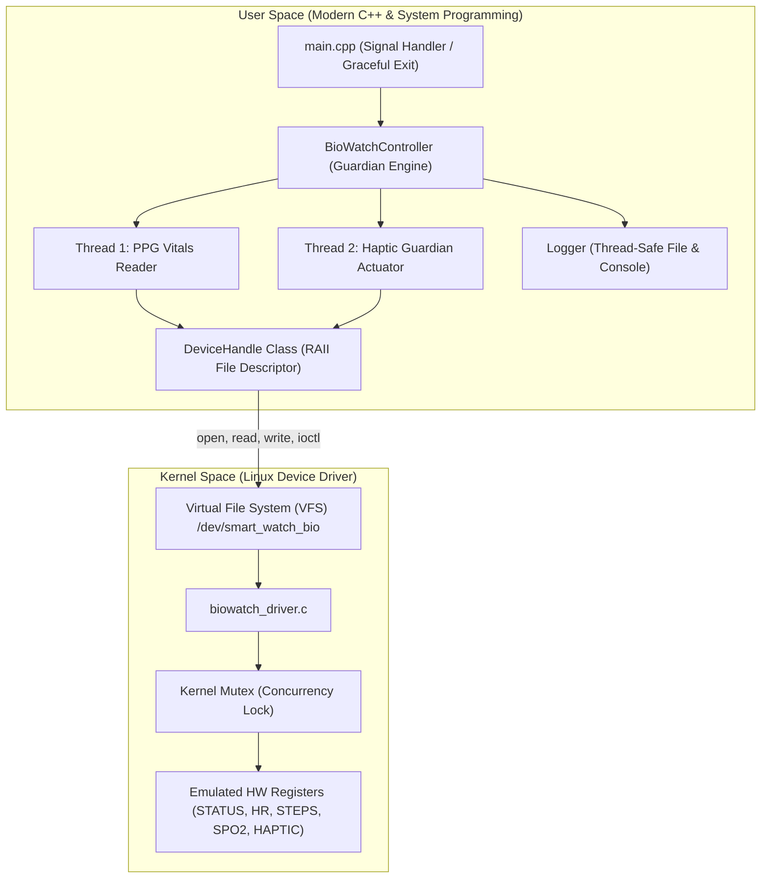

# Smartwatch Biosensor & Haptic Emergency Subsystem (V-BioWatch)

A complete end-to-end embedded Linux project bridging **Computer Architecture**, **Linux Kernel Character Drivers**, **System Programming**, and **Modern C++**.

---

## 🎯 Project Overview
Wearable health devices (smartwatches and fitness bands) continuously monitor vital signs—such as optical heart rate (PPG), blood oxygen saturation (SpO2), and pedometer step counts. When acute vital anomalies occur (such as sudden tachycardia where heart rate exceeds safe boundaries, or sudden high-G impacts indicating a fall), the system must immediately deliver tactile haptic feedback to alert the user and maintain a persistent medical audit trail.

This project implements a **Linux Character Device Driver** (`/dev/smart_watch_bio`) emulating the hardware registers of a biosensor and haptic vibration motor, coupled with a multi-threaded **Modern C++ Guardian Daemon** interfacing via POSIX system calls and standard IOCTL controls.

---

## 🏛️ System Architecture



---

## 💡 Key Technical Concepts Implemented

| Domain | Technical Concepts Implemented |
| :--- | :--- |
| **Computer Architecture** | Hardware register map (`REG_STATUS`, `REG_HEART_RATE`, `REG_STEP_COUNT`, `REG_SPO2`, `REG_HR_LIMIT`, `REG_HAPTIC_MOTOR`), bitwise status flags, memory-mapped I/O emulation. |
| **Linux Device Drivers** | Dynamic Major/Minor number allocation (`alloc_chrdev_region`), `cdev` registration, `/dev` node creation, `open()`, `release()`, `read()`, `write()`, custom `ioctl()` commands, kernel mutex synchronization. |
| **System Programming** | Multi-threading (`std::thread`), mutexes (`std::mutex`), condition variables, atomic flags, signal handling (`SIGINT`/`Ctrl+C`), persistent file logging. |
| **Modern C++** | RAII (`DeviceHandle` destructor cleans up file descriptors), object-oriented design, STL containers, custom exceptions, defensive error handling. |

---

## 📂 Repository Structure

```text
smartwatch-biosensor-controller/
├── Makefile                      # Top-level master build Makefile
├── README.md                     # Project overview and instructions
├── init_git_repo.sh              # 1-click script to generate progressive Git commits (Stages 1-6)
├── docs/                         # 6-Stage project documentation
│   ├── stage1_project_charter.md
│   ├── stage2_PRD.md
│   ├── stage3_system_architecture.md
│   ├── stage4_prototype_notes.md
│   ├── stage5_testing_guide.md
│   ├── stage6_viva_defense.md
│   └── presentation_slides.md
├── driver/                       # Kernel space character driver
│   ├── Makefile
│   ├── biowatch_ioctl.h          # Shared header (IOCTL definitions & registers)
│   └── biowatch_driver.c         # Driver implementation
├── src/                          # User space C++ application
│   ├── Makefile
│   ├── DeviceHandle.hpp          # RAII wrapper with Dual-Mode support
│   ├── DeviceHandle.cpp
│   ├── Logger.hpp                # Thread-safe logger
│   ├── Logger.cpp
│   ├── BioWatchController.hpp    # Multi-threaded controller
│   ├── BioWatchController.cpp
│   └── main.cpp                  # Entry point
└── tests/
    └── test_runner.sh            # Automated verification script
```

---

## 🚀 Build & Run Instructions

### 1. Build Both Driver and C++ Application
```bash
make all
```

### 2. Load the Kernel Module
```bash
make load
# Verify device node creation:
ls -l /dev/smart_watch_bio
```

### 3. Run the C++ Health Guardian Daemon
```bash
./src/biowatch_daemon 130
```

### 4. Unload the Kernel Driver
```bash
make unload
```

---

